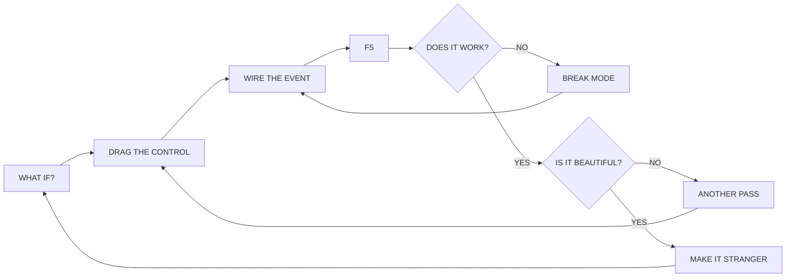
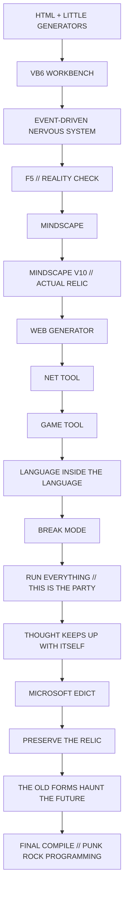

# SANE // THE VB6 MINDSCAPE

### PUNK ROCK PROGRAMMING // A SINGLE-FILE GENERATIVE SOFTWARE FILM

**Written · directed · programmed · detonated · scored by Luminosity / Matthew Kowalski**  
**Stories of Sane · CinemaDriver · Forge AI OS**

`BLACK / BONE / BLOOD / CHROME / CYAN` · `VB6` · `F5` · `32 SCENES` · `ZERO DEPENDENCIES` · `ONE HTML FILE`

> [!IMPORTANT]
> **F5 IS NOT A BUTTON. F5 IS A DETONATOR.**
>
> This is not a lecture about Visual Basic 6, a software obituary, or nostalgia painted over a modern webpage. It is a live software-building film about the feeling of finding a workbench fast enough for thought: drag the control, wire the event, hit F5, hate it, fix it, beautify it, make another impossible little machine before the idea cools down.

```text
╔══════════════════════════════════════════════════════════════╗
║  SANE // STREET RITUAL MACHINE                             ║
║  VISUAL BASIC 6 // INDUSTRIAL GOTHIC CYBERPUNK            ║
║  BEAUTY + FREEDOM + CODE                                   ║
║                                                            ║
║                     [ F5 ]                                  ║
║                  LIGHT THE FUSE                             ║
╚══════════════════════════════════════════════════════════════╝
```

## ⚡ LIVE TRANSMISSION // ENTER THE MINDSCAPE

<div align="center">

### **[▶ WATCH SANE // THE VB6 MINDSCAPE LIVE](https://unixarcade.github.io/SaneVb/)**

**`https://unixarcade.github.io/SaneVb/`**

`NO INSTALL` · `NO LOGIN` · `NO BUILD` · `CLICK → AUDIO UNLOCK → F5`

[**WATCH FILM**](https://unixarcade.github.io/SaneVb/) · [**READ SOURCE**](./SANE_VB6_MINDSCAPE_CINEMA_CROWN_MASTER_v12_AUDIO_BUS_LEGIBILITY_CROWN.html) · [**REPORT A GLITCH**](https://github.com/unixarcade/SaneVb/issues/new?title=%5BGLITCH%5D%20SANE%20VB6%20-%20&body=Browser%20%2B%20version%3A%0AOS%20%2F%20device%3A%0AScene%20number%20%2F%20title%3A%0AExpected%3A%0AObserved%3A%0AAudio%20played%3F%3A%0AVOICE%20worked%3F%3A%0A%0ASaneFilm.health()%3A%0A__SANE_V12.audioState()%3A) · [**FORK THE MACHINE**](https://github.com/unixarcade/SaneVb/fork)

</div>

> [!IMPORTANT]
> **THE GITHUB PAGES BUILD IS THE FRONT DOOR.** Click the live-film link above, then click **BEGIN THE MINDSCAPE**. That first deliberate click is part of the ignition sequence: browsers require a trusted user gesture before speech and audio can fully wake up.

```text
LIVE SIGNAL
    │
    ├──► WATCH  https://unixarcade.github.io/SaneVb/
    │
    ├──► BREAK  hit F5! inside the film
    │
    ├──► PROBE  open DevTools → SaneFilm.health()
    │
    └──► FORK   change the machine → reload → make it stranger
```

### LOCAL / OFFLINE CARTRIDGE

The current single-file master is:

[`SANE_VB6_MINDSCAPE_CINEMA_CROWN_MASTER_v12_AUDIO_BUS_LEGIBILITY_CROWN.html`](./SANE_VB6_MINDSCAPE_CINEMA_CROWN_MASTER_v12_AUDIO_BUS_LEGIBILITY_CROWN.html)

No npm. No framework. No server. No asset directory. No external library stack. Download the HTML and it remains a complete offline film cartridge.

```text
1. Open the live film — or download the HTML.
2. Click BEGIN THE MINDSCAPE.
3. Turn it up.
4. Let the workbench wake up.
5. Hit F5! whenever the machine needs more trouble.
```

The film carries its own visual engine, scene data, embedded Mindscape V10 relic, authored score, procedural audio machinery, voice system, interaction layer, diagnostics, and mobile repair path inside the document.

> [!TIP]
> **HEADPHONES OR DECENT SPEAKERS RECOMMENDED.** The authored Cyberpunk DAO track is the musical authority; the procedural Forge layer lives underneath it as electrical nerve, impacts, distorted guitar, machine texture, and scene response.

## CONTROL DECK

| Input | Detonation |
|---|---|
| <kbd>Space</kbd> | Pause / resume |
| <kbd>←</kbd> / <kbd>→</kbd> | Previous / next scene |
| <kbd>M</kbd> | Music + effects on / off |
| <kbd>F</kbd> | Fullscreen |
| <kbd>D</kbd> | Voice / runtime diagnostics |
| <kbd>B</kbd> or <kbd>R</kbd> | Trigger a live **F5!** build burst |
| <kbd>Enter</kbd> | Start / rebuild when available |
| `VOICE` | Narration ↔ text-only mode |
| `F5!` | Live VB build burst: packets, riffs, flashes, trouble |
| `SHARE` | Native share sheet or clipboard fallback |
| Swipe | Previous / next scene on touch screens |
| `AUDIO` reconnect | Re-arm the score after a phone/background audio interruption |

## WHAT THE FILM IS ACTUALLY ABOUT

Sane already knows code. HTML, generators, little machines. Then Visual Basic 6 arrives and changes the shape of programming.

A form is visible before it is finished. A button can be moved before its behavior exists. Properties sit beside code. Events wait everywhere. `Click`, `Change`, `Timer`, incoming data: the program stops feeling like a parade of instructions and starts feeling like a nervous system.

Then the workshop gets abused properly.

- **Mindscape Char Gen** grows from a character generator toward a world-machine.
- The **actual Mindscape V10 relic** appears inside the film rather than being imitated from memory.
- A **Web Generator** turns repetition into machinery.
- A **Net Tool** pokes the wire and makes network behavior visible.
- A **Game Tool** argues that joy is a valid specification.
- A **language inside the language** pushes the toolmaker instinct toward metaprogramming.
- **Break Mode** becomes part of the creative loop: break it, expose it, understand it, repair it.
- The VB6 IDE gets a fucking band.
- Everything runs at once.
- Then the corporate edict arrives.

The film does not pretend that a product decision is a law of nature. It asks a harder question: **if the builders, artifacts, syntax, and desire to keep building still exist, why should a workshop be treated as if it vanished?**

> [!WARNING]
> **UNSUPPORTED IS NOT DEAD.**
>
> The last act is not about freezing VB6 in amber. It is about preserving the pattern: immediate visual construction, event-driven thought, fast feedback, weird little utilities, creator-owned tools, and the right to keep useful machinery alive after a vendor moves on.

## THE SANE LOOP



That loop is the thesis of the movie.

## BUILD STATUS // THE MACHINE IS HOT

- [x] 32 authored scenes
- [x] 21 ensemble / multi-voice scenes
- [x] Sane + VB6 IDE + Mindscape + Event Chorus + Punk Chorus + Archive + Net Tool + Game Tool + Microsoft Edict + Design Ghost
- [x] Embedded real Mindscape V10 visual relic
- [x] Visual Basic workbench / event wiring / property editing / runtime sequences
- [x] Web generator, network tool, game tool, tiny-language machinery
- [x] Break-mode bug hunt and rebuild loop
- [x] Authored Cyberpunk DAO score embedded in the document
- [x] Procedural hardcore-punk / cyberdeck Forge layer beneath the authored track
- [x] Four-path cinema audio architecture with dedicated music, FX, modem/data, and voice behavior feeding a mastered output
- [x] Cue-linked browser speech synthesis with text-only fallback
- [x] Phone-safe direct score path + explicit audio reconnect after backgrounding
- [x] Adaptive Canvas 2D cinematography targeting 60 FPS
- [x] CRT / Xerox / circuit / industrial-gothic visual stack
- [x] Keyboard, touch, fullscreen, sharing, diagnostics, and live F5 interaction
- [x] Runtime health / mix / mobile proof API
- [x] Zero external runtime assets or third-party libraries
- [x] Live GitHub Pages launch deck — `unixarcade.github.io/SaneVb/`
- [ ] Permission from a clean office

## STORY CIRCUIT



<details>
<summary><strong>☠ OPEN THE 32-SCENE DETONATION MANIFEST</strong></summary>

1. `COLD OPEN // SANE IS ALREADY RUNNING`
2. `WHO THE FUCK IS SANE`
3. `BEFORE VB // ALREADY MAKING MACHINES`
4. `THE BOX ARRIVES // OH SHIT, A WORKBENCH`
5. `EVENTS // THE PROGRAM WAKES UP`
6. `DROP THE BUTTON // GIVE IT CONSEQUENCES`
7. `WORKS IS NOT ENOUGH // MAKE IT BEAUTIFUL`
8. `EVENT ANARCHY // EVERY CONTROL IS A DOOR`
9. `F5 // REALITY CHECK`
10. `FORMS AS ROOMS // UI AS ARCHITECTURE`
11. `MINDSCAPE STARTS EATING THE ROOM`
12. `BEAUTY PASS // I WANT THE MACHINE TO HAVE A FACE`
13. `MINDSCAPE V10 // THE ACTUAL RELIC`
14. `REROLL THE WORLD // SURPRISE ME`
15. `WEB GENERATOR // IF I DO IT TWICE, THE MACHINE DOES IT`
16. `NET TOOL // POKE THE WIRE`
17. `GAME TOOL // JOY IS A VALID SPECIFICATION`
18. `LANGUAGE INSIDE THE LANGUAGE // NOW THE TOOL MAKES TOOLS`
19. `BREAK MODE // EXCELLENT, NOW WE KNOW`
20. `THE DESKTOP BECOMES A RIOT // FASTER`
21. `GIVE THE IDE A FUCKING BAND`
22. `RUN EVERYTHING // THIS IS THE PARTY`
23. `WHY I LOVED VB6 // THOUGHT COULD KEEP UP WITH ITSELF`
24. `THE EDICT // SOMEONE CLOSES THE WORKSHOP`
25. `THAT WAS NOT NATURE // THAT WAS A DECISION`
26. `OPEN THE FUCKING WORKSHOP`
27. `UNSUPPORTED IS NOT DEAD`
28. `PRESERVE THE RELIC // STEAL BACK THE PATTERN`
29. `THE OLD FORMS ARE HAUNTING THE FUTURE`
30. `DECKER BRAIN // TECH PLUS MAGIC`
31. `FINAL COMPILE // PUNK ROCK FUCKING PROGRAMMING`
32. `POST // THEY DO NOT OWN THE RUN BUTTON`

</details>

## CINEMA MACHINERY // DO NOT HIDE THE WIRES

| Layer | What is alive inside the file |
|---|---|
| **Picture** | Procedural Canvas 2D scenes, VB6 workbench simulations, UI architecture, runtime traces, relic compositing, particles, signal fractures, match cuts |
| **Visual grammar** | 1989–95 street-tech, ritual circuitry, Xerox abrasion, industrial material decay, controlled deconstruction, black/bone/blood/chrome/cyan |
| **Score** | **“ASCENSION OF THE LIQUID LIGHT // CITIES OF CRYSTAL”** — Cyberpunk DAO authored track, ~172.49 seconds |
| **Forge music layer** | Hardcore punk downstrokes, bass, drums, cyberdeck leads, distorted guitar, scene motifs, 32-bar song logic |
| **Sound design** | Impacts, machine pulses, packet/data texture, modem-like line sounds, reverberation, delay, compression, ducking |
| **Voice** | Browser speech synthesis mapped across an ensemble cast; speech-linked editing and text fallback |
| **Interaction** | Transport, scene jumps, F5 bursts, voice mode, fullscreen, touch swipe, sharing, diagnostics |
| **Mobile** | Trusted-gesture startup, large reachable controls, direct authored-score fallback, explicit return-from-background reconnect |
| **Proof** | Runtime health, FPS telemetry, mix state, embedded relic test, mobile geometry checks, audio-state probe |

<details>
<summary><strong>⚙ FORGE LINEAGE // WHAT FED THE MACHINE</strong></summary>

The film's source identifies a lineage of reusable cinema and software machinery including:

- Speech Forge v9 timing and cue-linked browser speech
- NibbleAndByte replay / proof discipline
- NullShader field machinery
- Toaster switching choreography
- Polyverse stage depth
- Ludic interaction loops
- Gusto recursive allocation
- Director / Sound / Music Forge ideas
- Cyberdeck Super Forge lineages

The point is not to make the audience memorize forge names. The point is that the film is built like software: reusable engines underneath, authored scenes above, and a live runtime joining them.

</details>

## RUNTIME PROOF CONSOLE

Open DevTools while the movie is running — including directly on **[the live GitHub Pages build](https://unixarcade.github.io/SaneVb/)**. The film exposes a small inspection surface instead of demanding blind faith.

```js
SaneFilm.health()
```

Returns live information about scene count, cast count, audio buses, score architecture, embedded relic state, current scene, pause/run state, target FPS, measured FPS, render cost, adaptive quality, dropped frames, and runtime errors.

```js
SaneFilm.mix()
```

Inspect the current master / music / FX / voice mix.

```js
SaneFilm.mobileProof()
```

Inspect viewport, coarse-pointer status, reachable controls, embedded-score readiness, AudioContext state, safe-area support, and playback state.

```js
SaneFilm.goto(12)   // jump into the relic / Mindscape region
SaneFilm.demo()     // trigger the F5 build burst
```

For the v12 audio repair layer:

```js
__SANE_V12.audioState()
```

That reports whether the authored score is running, where it is in the track, its media readiness, and whether Web Audio is running or waiting for another trusted gesture.

> [!NOTE]
> The diagnostics are part of the aesthetic. **The machine is allowed to show its organs.**

## WHY VB6 MATTERS HERE

The film's argument is not “old software good, new software bad.” It is more specific.

VB6 made certain kinds of thought unusually cheap to test. Interface and behavior lived close together. A control could become visible, movable, nameable, and eventful almost immediately. The distance between **idea → evidence → revision** could become very small.

For Sane, that speed is not merely convenience. It is creative freedom.

```vb
Private Sub cmdGenerate_Click()
    Call MakeSomethingWeirder
End Sub
```

The exact program is fictionalized cinema. The instinct is not.

## AESTHETIC CONSTITUTION

```text
NO CLEAN CORPORATE TOMBSTONE.
NO BEIGE RETRO NOSTALGIA FILTER.
NO “LOOK, AN OLD COMPUTER” TOURISM.

YES  : XEROX / CIRCUIT / CHROME / BLOOD / CRT / INDUSTRIAL DECAY
YES  : BEAUTIFUL INTERFACES
YES  : VISIBLE MACHINERY
YES  : EVENT WIRES
YES  : FAST THOUGHT
YES  : WEIRD TOOLS
YES  : BUGS THAT BECOME KNOWLEDGE
YES  : JOY AS A SPECIFICATION
YES  : PRESERVATION AS RESISTANCE TO FORGETTING
YES  : F5
```

## ONE FILE MEANS ONE FILE

```text
SaneVb/
├── README.md                          ← launch deck / zine / manual
├── index.html                         ← GitHub Pages ignition point
└── SANE_VB6_MINDSCAPE_CINEMA_CROWN_MASTER_v12_AUDIO_BUS_LEGIBILITY_CROWN.html
    ├── film engine
    ├── 32 scenes
    ├── cast + dialogue
    ├── Mindscape V10 relic
    ├── authored music
    ├── procedural score layer
    ├── sound engine
    ├── speech system
    ├── controls
    ├── phone audio repair
    ├── diagnostics
    └── the whole damn movie
```

There is no “assets missing” folder to lose twenty years from now. GitHub Pages supplies the public doorway; the movie itself remains a self-contained cartridge.

## GLITCH REPORT // IF YOU BREAK IT, BRING BACK EVIDENCE

GitHub Issues are welcome for reproducible film/runtime failures. **[OPEN A PREFILLED GLITCH REPORT](https://github.com/unixarcade/SaneVb/issues/new?title=%5BGLITCH%5D%20SANE%20VB6%20-%20&body=Browser%20%2B%20version%3A%0AOS%20%2F%20device%3A%0AScene%20number%20%2F%20title%3A%0AExpected%3A%0AObserved%3A%0AAudio%20played%3F%3A%0AVOICE%20worked%3F%3A%0A%0ASaneFilm.health()%3A%0A__SANE_V12.audioState()%3A)** or bring the same evidence manually:

```text
[GLITCH] short description

Browser + version:
OS / device:
Desktop or touch:
Scene number / title:
What you expected:
What happened:
Did audio play?:
Did VOICE work?:

Console:
SaneFilm.health()
__SANE_V12.audioState()
```

For visual glitches, add a screenshot. For audio failures, include the two diagnostic objects above if possible. For a bug that appears only after leaving the browser and returning, say so—the film has a specific background/gesture audio path.

## HACKING THE FILM

You do not need a build system to fork this. It is deliberately inspectable.

Search the source for:

```text
const S=                 // scene manifest
const CAST=              // voice constellation
SCORE_DNA                // procedural music identities
MINDSCAPE_V10_IMG        // embedded relic
TRACK_TITLE              // authored score authority
window.SaneFilm          // public runtime inspection API
__SANE_V12               // v12 audio-state / phone repair layer
```

Change something. Open the file. Hit F5. If your fork publishes with GitHub Pages, the repository itself becomes the projector.

```text
SOURCE → SAVE → RELOAD → WATCH → BREAK → FIX → BEAUTIFY → COMMIT → TRANSMIT
```

That is the development environment.

## CREATOR SIGNAL

**Luminosity / Matthew Kowalski**  
Stories of Sane · CinemaDriver · Forge AI OS

- Project: <https://github.com/unixarcade/SaneVb>
- Live film: <https://unixarcade.github.io/SaneVb/>
- GitHub: <https://github.com/unixarcade>
- LiveJournal: <https://luminosity.livejournal.com>
- Forge AI OS: <https://luminosity.gumroad.com/l/fyosxi>
- Gumroad: <https://gumroad.com/products>
- Books: <https://www.goodreads.com/review/list/1550470-matthew-kowalski?ref=nav_mybooks&shelf=books-i-have-written>
- Support: **Cash App `$unixarcade`** — <https://cash.app/$unixarcade>

## LICENSE + EXHIBITION

Copyright © Luminosity / Matthew Kowalski.

Preserve the creator credit when sharing or exhibiting the film. Contact the creator for commercial licensing, installation, festival, classroom, gallery, archival, or other organized exhibition use.

---

```text
MICROSOFT EDICT : MIGRATE.
SANE            : OPEN THE SOURCE.
PUNK CHORUS     : THAT IS A PRESS RELEASE, NOT PHYSICS.
ARCHIVE         : THE ARTIFACTS REMAIN.
SANE            : THEN THE WORKSHOP DESERVED AN AFTERLIFE.

C:\VB6> F5
C:\VB6> STILL RUNNING
C:\VB6> _
```

### **[▶ LIGHT THE FUSE // WATCH THE FILM](https://unixarcade.github.io/SaneVb/)**

### THEY DO NOT OWN THE RUN BUTTON.
